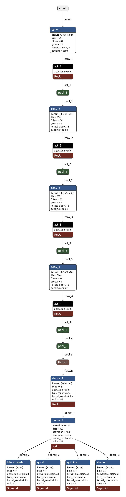

# DocuNet

DocuNet is the deep learning based model trained to detect the various anamoly documents. 

## Initial Commit
Data is beign trained with four classes of data good, black border, gridline, shaded total of equally distributed 713 images 

## Exp Branch Updates
* trained the model with 480x480 size for better resolution it works next attempt to check with 640x640
* converted the raw data from 480x480 to 640x640 and done the training by this, model achieves the sweet spot by the 3rd epoch itself so as of now it's good to go with 640x640 batch size 4 with these params

## Architecture of Model
